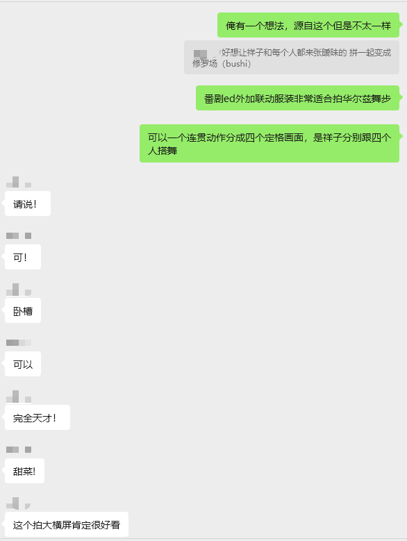

# Feburary

## Feb 28th

从离职到现在，除去收拾/见朋友/玩游戏/玩cosplay，其他大部分时间像蛆一样躺着

爽出cosplay，这玩意还是得越出才越有自己的想法。最开始虚荣心和还原的心理各占一半，中间过程也有过想放弃，毕竟还是很烧钱，基本一次的开销在k+。后面拍过团片之后发现跟同好共同创作的这种感觉真的很爽，而且还能认识不同圈子的人

现在想继续提升自己（虽然现阶段还是砸钱）去跟更多人合作，或者是自己去把某些灵光乍现的想法实现

然后是时候该找工作了

年前其实也有几天看了些八股文，看的人头都大了，而且回想起之前面试的时候，感觉是项目相关的问题没答好，对面没招了才问题基础内容

anyway各方面还是需要恶补一下

目前最理想的状态是三月份就找到工作，然后我直接去下定禁军小教头全套cos（不确定，如果找阈限山感觉预算可能得在w左右）

更有可能是三月份都用来攒经验，四月份找到工作，而且这么算，也得差不多国庆才能转正
