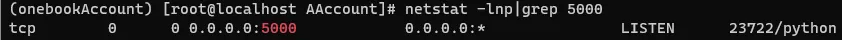
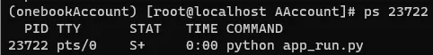

# 常用命令

## 查看端口占用

```bash
netstat -lnp|grep <port>
lsof -i:<port>
```

如果出现 `lsof: command not found` ，则需要安装lsof，以CentOS为例，安装 lsof 的命令为 `sudo yum install lsof` 



## 查看进程详细信息

```bash
ps <pid>
```



## 杀进程
### 根据端口
```bash
kill -9 <port>
```

### 根据服务名称
```bash
killall <service_name>
```

## 查看Linux下隐藏文件
```bash
ls -a <path>
```

## Windows向Linux传文件
### 单个文件
```bash
scp <src file> username@IP:<dst path>
```

### 整个文件夹
```bash
scp -r <src file> username@IP:<dst path>
```

## 查看历史登录记录

```bash
last
```

## 查看历史登录(未成功)记录

```bash
lastb
```

## 查看IP

```bash
# 公网IP
curl ifconfig.me

# 内网IP
ifconfig | grep inet
```

## 以系统服务启动程序

创建服务文件 `/etc/systemd/system/<name>.service`
```bash
[Unit]
Description=<Description>
After=network.target

[Service]
User=root
WorkingDirectory=/path/to/your/project
ExecStart=/usr/bin/npm run serve    # 要运行的程序
# ExecStart=/usr/bin/python xxx.py
Restart=always

[Install]
WantedBy=multi-user.target
```

```bash
sudo systemctl daemon-reload
sudo systemctl start <name>.service
sudo systemctl enable <name>.service  # 开机自启
```


## 将工具的可执行文件路径添加到系统的 PATH 环境变量中
### 临时
```bash
export PATH=<your_tool_path>:$PATH
```

### 永久
```bash
echo 'export PATH=<your_tool_path>:$PATH' >> ~/.bashrc
source ~/.bashrc
```