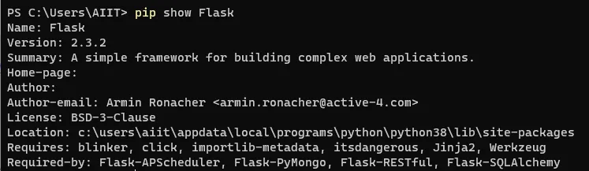
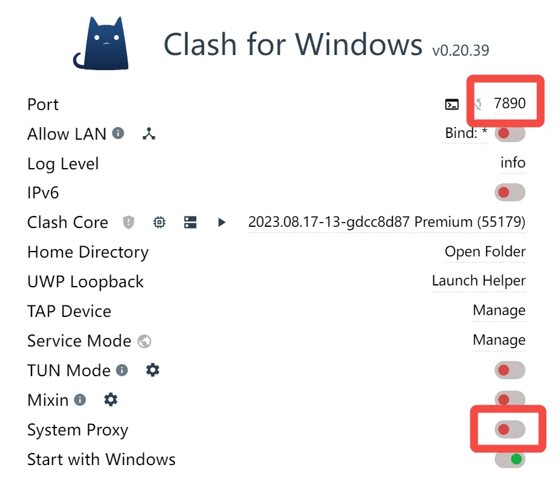

# 常用指令

## 用requirements.txt批量安装python库
```bash
conda install --file requirements.txt
```

安装完成后可用如下命令查看
```bash
conda list
```

## 生成环境配置requirements.txt

```bash
pip freeze > requirements.txt
```

## 查看所有库

```bash
pip list
```

## 查看库的具体内容
```bash
pip show <package>
```



## 设置镜像源

### 临时

```bash
pip install -i https://pypi.tuna.tsinghua.edu.cn/simple <package>
pip install -i http://mirrors.aliyun.com/pypi/simple/ <package>
pip install -i http://pypi.douban.com/simple/ <package>
```

### 永久
修改pip.conf文件
```bash
[global] 
index-url = https://pypi.tuna.tsinghua.edu.cn/simple
[install]
trusted-host=mirrors.aliyun.com
```
补充：Linux下是在 `.pip` 目录中

## 配置代理
梯子如果用的是clash，默认端口是7890



在 python 脚本中添加如下代码：
```python
import os
os.environ["http_proxy"] = "http://127.0.0.1:7890"
os.environ["https_proxy"] = "http://127.0.0.1:7890"
```

运行前确保代理已开启

## 命令行创建激活虚拟环境

```bash
pip install virtualenv
```

安装完成后才能用 python 在命令行创建虚拟环境并使用

```bash
python -m venv <your_venv_name>
```

执行后会在命令行所在目录下创建一个目录，存放环境设置相关文件，因此可以在 .gitignore 文件中加上该目录  
激活（linux）
```bash
source ./<your_venv_name>/bin/activate
```

激活（windows）
```bash
.\<your_venv_name>\bin\activate
```
此时通过 pip install 安装的库全部安装在虚拟环境下