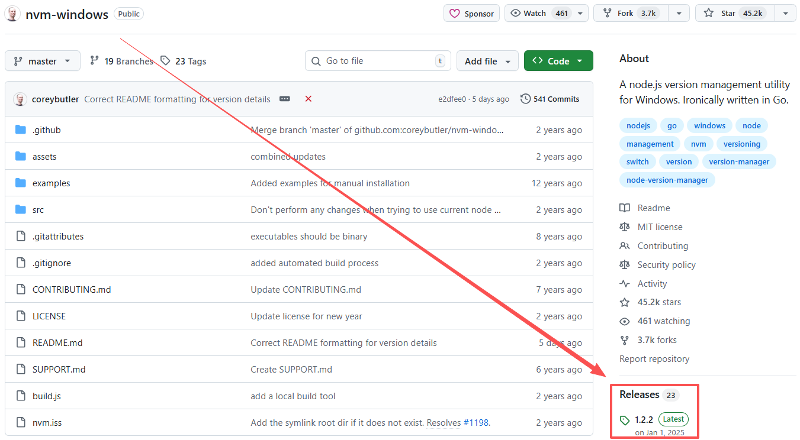
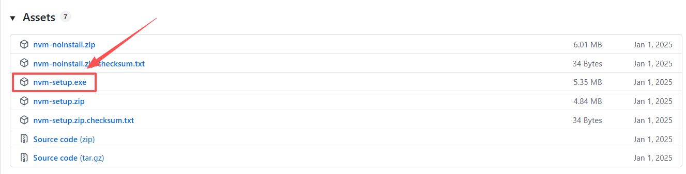

# nvm (Node Version Manager)

## 什么是 nvm？

它是一个用来管理多个 Node.js 版本的工具，可以让你在一台电脑上：

- 安装多个不同版本的 Node.js
- 在不同版本之间快速切换
- 为不同项目使用不同的 Node 版本

## Windows 使用步骤

### 卸载现有 Node

控制面板 → 卸载 Node.js

### 安装 nvm-windows

GitHub 下载地址：https://github.com/coreybutler/nvm-windows

进入 **Releases** 页面，下载 `nvm-setup.exe` 进行安装。




安装过程中会提示设置两个关键路径：

1. **NVM 安装目录**
   例如：

   * `D:\nvm`
   * 默认：`C:\Program Files\nvm`

2. **Node.js 软链接目录（NVM_SYMLINK）**
   例如：

   * `D:\nodejs`
   * 默认：`C:\Program Files\nodejs`

安装完成后：

* NVM 会把不同版本的 Node.js 安装在 **NVM 目录** 下
* 并在 `NVM_SYMLINK` 目录创建一个 **软链接**
* 每次执行 `nvm use`，其实就是切换这个软链接指向的 Node 版本
* 安装完成后记得**重新打开终端**

<div className="alert alert--info"> 
    <span>重要规则</span> <br/>
    <span>1. 安装路径必须是**空目录**</span> <br/>
    <span>2. 同级目录下不能已经存在 `nodejs` 文件夹</span> <br/>
    <span>3. 如果 `NVM_SYMLINK` 指向的目录已经是一个真实文件夹，会导致 `nvm use` 失败</span> 
</div>
<br/>
如果 `NVM_SYMLINK` 指向的目录已经存在真实文件夹，会出现类似错误：

```bash
C:\Windows\System32>nvm use 22.21.1
activation error:
NVM_SYMLINK is set to a physical file/directory at D:\nodejs
Please remove the location and try again, or select a different location for NVM_SYMLINK.
```

**解决方法：** 删除该真实文件夹，或者重新指定一个不存在的目录。


### 安装新版本 Node

比如安装最新版 LTS：

```bash
nvm install 22.21.1
```

查看可安装版本：

```bash
nvm list available
```

### 使用某个版本

```bash
nvm use 22.21.1
```

验证：

```bash
node -v
npm -v
```

## 设置镜像源

### 找到配置文件

执行如下命令，查看安装目录

```bash
nvm root
```

### 修改 settings.txt

打开 settings.txt，修改或添加如下内容后保存

```ini
node_mirror: https://npmmirror.com/mirrors/node/
npm_mirror: https://npmmirror.com/mirrors/npm/
```
### 重新安装 Node 测试

如果速度明显变快，说明镜像生效

### 常用镜像源

**Node 镜像**
```
https://npmmirror.com/mirrors/node/
```
**npm 镜像**
```
https://npmmirror.com/mirrors/npm/
```