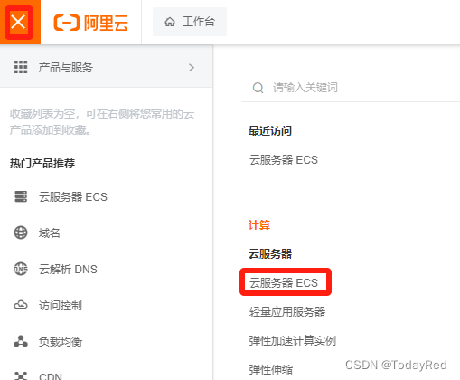
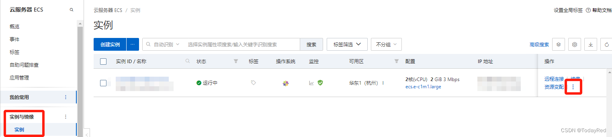
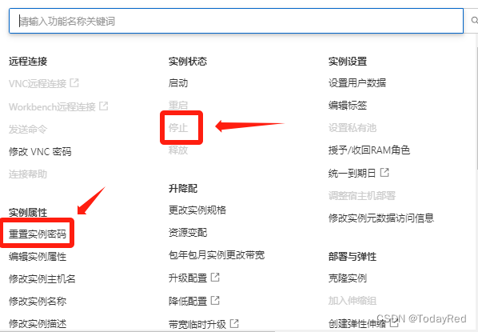
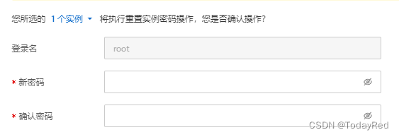

# 阿里云 云服务器设置密码/重置实例密码

## 个人选择

**2核2G**
固定带宽**3M**
**40G**存储空间
操作系统选的**CentOS 7.9**

## 设置密码

在购买云服务器之后需要设置密码，否则无法远程连接。

首先进入控制台，在左侧栏找到**云服务器ECS**

在左侧找到实例，点击操作栏目下的 **···**

服务器默认是开启状态，等几分钟初始化之后，先停掉服务器（例图是停止的状态）。然后点击**实例属性**下的**重置实例密码**。

输入密码，确认后即可开启云服务器

