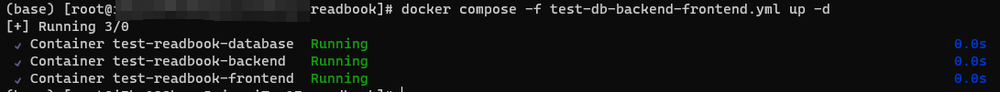
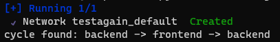

# docker 实战

## dockerfile 和 docker-compose

### dockerfile

dockerfile包含了一系列配置指令，**用于构建自定义镜像**。指令不分大小写，格式为

```bash
# Comment
INSTRUCTION arguments
```
dockerfile的第一条指令必须是`FROM`指令，`FROM`指令指定了构建的基础镜像。如`FROM centos:7.9.2009`等，也可以选择空白镜像`FROM scratch`。

`MAINTAINER` 用于标记自定义镜像的作者，格式是`作者名<作者邮箱>`。  
例如：`MAINTAINER Achinoise1<today_red@163.com>`

`COPY` 指令用于将本机指定位置的文件或目录复制到镜像，在创建容器后运行服务。推荐在执行 `RUN` 前完成所有内容的复制，存在多个复制内容时，可以选择用空格间隔不同的内容，也可以使用换行符。需要注意的是，如果文件不存在或者路径错误，docker将终止构建镜像并报错。

```bash
# 将本机的三个目录内容复制到镜像中
COPY /root/test/ /root/build/ /root/run/ /root/
# 等效于
COPY /root/test/  \
     /root/build/ \
     /root/run/ /root
```

`RUN` 指令会在当前镜像上新建一层，并在该层执行指定的命令(例如下载资源等)。执行完成后会提交当前运行结果，提交后的镜像会用于dockerfile的后续步骤。如果有多条 `RUN` 指令，建议合并成一条指令，避免出现多层内容，导致镜像臃肿。合并后需要注意，如果其中一条命令出现问题(例如找不到下载资源)，那么整条指令可能会执行失败。

```bash
# CentOS基础镜像中安装MySQL
RUN cd /root 
RUN yum -y update 
RUN yum -y install wget 
RUN wget https://repo.mysql.com//mysql80-community-release-el7-1.noarch.rpm 
RUN rpm -ivh mysql80-community-release-el7-1.noarch.rpm 
RUN yum -y install mysql mysql-server --nogpgcheck 
RUN rm mysql80-community-release-el7-1.noarch.rpm 

# 合并如下
RUN cd /root \
    && yum -y update \
    && yum -y install wget \
    && wget https://repo.mysql.com//mysql80-community-release-el7-1.noarch.rpm \
    && rpm -ivh mysql80-community-release-el7-1.noarch.rpm \
    && yum -y install mysql mysql-server --nogpgcheck \
    && rm mysql80-community-release-el7-1.noarch.rpm \
```

`CMD` 指令为可运行容器提供默认设置。一个 Dockerfile 只能有一个 `CMD` 指令，如果有多条指令，那么只有最后一条 `CMD` 指令生效。官方给出了三种指令书写方式，笔者现在只用了其中一种

```bash
CMD echo "build finished"
```

### docker-compose

在用docker部署应用时，大部分情况下会需要多个容器共同运作。docker-compose是一个方便运行多个容器的集成工具。仅需要把相关配置写入一个 YAML 文件，在命令行执行命令`docker compose -f <yml file> up -d`，即可完成创建和启动所有服务。

一个 YAML 文件的书写格式大致如下：

```yaml
version:                # 指定 compose 版本，可选项
services:               # 具体服务配置的开始
  mysql:                # 服务的名称
    image:              # 指定基础镜像
    container_name:     # 容器的名称
    environment:        # 环境变量
    volumes:            # 数据卷挂载，即文件从host传到container
    ports:              # 端口映射，格式为 宿主机:容器，例-3308:3306
    user:               # 指定用户
    restart:            # 重启方式，即指定重启容器的时机
    depends_on:         # 依赖关系，即在指定服务启动后才启动本服务
    tty:                # 伪终端，容器是否使用tty运行，nginx/mysql/redis没有该语法
```

当有多个服务的时候，如果没有指定各个服务所处的网络，默认所有服务在同一个网络下。

## 步骤

项目Readbook是一个前后端分离的应用。用docker部署项目Readbook，根据docker各司其职的特性，需要拆分为三个部分：前端、后端和数据库。前端使用React，通过 `npm build` 打包静态文件；后端使用Flask框架和蓝图，无需进行额外打包；数据库使用MySQL，可以把表结构和数据导出为sql执行文件。

### 准备部署内容
将前端、后端和数据库三个部分的内容分别存入frontend、backend和database目录中，层级结构如下：

```bash
├── backend
│   ├── ...
├── database
│   ├── ...
├── frontend
│   ├── ...
├── xxx.yml
```

### 选择部署方式
docker部署可以通过 Dockerfile ，构建镜像并创建容器运行，也可以将配置写入 YAML 文件中，通过 docker-compose 用基础镜像构建容器，无需制作额外的镜像（当然 docker-compose 也支持自定义镜像）。相对于 Dockerfile，docker-compose 提供了更为方便和全套的服务。笔者选择使用后者。

### 编写 YAML 文件
在目录同级下编辑 YAML 文件如下：

```yaml                                     
version: '3'                      
services:                         
  mysql:
    image: mysql:8.0.26
    container_name: test-readbook-database
    environment:
      - MYSQL_ROOT_PASSWORD=123456
    volumes:
      - /home/docker/mysql8/log:/var/log/mysql
      - /home/docker/mysql8/data:/var/lib/mysql
      - /home/docker/mysql8/conf.d:/etc/mysql/conf.d
      - /etc/localtime:/etc/localtime:ro
      - /root/projs/docker_test/readbook/database/:/root/database/
    ports:
      - 3308:3306
    user: root
    restart: always
  backend:
    image: python:3.8
    container_name: test-readbook-backend
    environment:
      - TZ=Asia/Shanghai
    volumes:
      - /root/projs/docker_test/readbook/backend/:/root/backend/
    ports:
      - 5000:5000
    restart: on-failure
    depends_on:
      - mysql
    tty: true
  frontend:
    image: nginx:1.20
    container_name: test-readbook-frontend
    environment:
      TZ: Asia/Shanghai
    volumes:
      - /root/projs/docker_test/readbook/frontend/nginx.conf:/etc/nginx/nginx.conf
      - /root/projs/docker_test/readbook/frontend/:/root/frontend/
      - /opt/docker-nginx/conf.d/:/etc/nginx/conf.d/
    ports:
      - 8080:80
    restart: always
    depends_on:
      - backend
```

### 启动整个服务+测试
命令行定位到 YAML 文件的位置，运行如下命令：

```bash
docker compose -f <yml name> up -d
```

其中 -f 是指定 YAML 文件构建容器， -d 是在后台运行。

此时可以看到 docker 逐个创建容器并运行



此时进入容器执行 bash 命令

```bash
sh xxx.sh
```

退出容器回到本机，执行命令测试联通性

```bash
# MySQL 数据库
curl http://localhost:3308
# 8.0.26[EClI%�����ACSK:a;OYScaching_sha2_password!��#08S01Got packets out of order

# React 前端
curl http://localhost:8080
# <!doctype html><html lang="en"><head><meta charset="utf-8"/><link rel="icon" href="/favicon.ico"/><meta name="viewport" content="width=device-width,initial-scale=1"/><meta name="theme-color" content="#000000"/><meta name="description" content="Web site created using create-react-app"/><link rel="apple-touch-icon" href="/logo192.png"/><link rel="manifest" href="/manifest.json"/><title>React App</title><script defer="defer" src="/static/js/main.7e293540.js"></script><link href="/static/css/main.ca63e079.css" rel="stylesheet"></head><body><noscript>You need to enable JavaScript to run this app.</noscript><div id="root"></div></body></html>

# Python 后端
curl http://localhost:5000/<your-url>
# your response
```

测试完毕，容器启动成功。

## 尝试用 Dockerfile 构建镜像过程中遇到的问题

先从比较简单的上手，构建后端镜像。编写如下Dockerfile

```bash
FROM centos:7.9.2009
MAINTAINER Achinoise1<today_red@163.com>

COPY Python-3.8.10.tgz \
     /backend/ /root/

RUN su - root \
    && cd /root \
    && yum -y update \
    && yum -y install make \
    && yum -y install gcc gcc-c++ \
    && yum -y install automake autoconf libtool make \
    && yum -y install zlib-devel bzip2-devel openssl-devel ncurses-devel sqlite-devel readline-devel tk-devel libffi-devel \
    && tar xvf Python-3.8.10.tgz \
    && cd Python-3.8*/ \
    && ./configure --prefix=/usr/local/python3  \
    && make \
    && make install \
    && ln -s /usr/local/python3/bin/python3 /usr/bin/python3 \
    && cd .. \
    && rm Python-3.8.10.tgz \
    && python3 --version

CMD echo 'custom build finished'
```
构建镜像的时间约为6min，镜像大小为1.14G。

### 问题1 pip command not found
安装基于 CentOS 的自定义镜像后，新建容器并进入容器终端（具体命令详见 docker 命令合集），检查 Python 版本，发现 `python --version` 显示为2.7.5，为 CentOS 安装时的初始 Python 版本，而 `python3 --version` 显示为3.8.10。再检查 pip 命令，显示 command not found。

尝试修改 Dockerfile ，通过软链接使 pip 生效，并重新构建镜像。但在生成容器后没有找到bin文件，因此 `ln -s /root/Python-3.8.10/bin/pip /usr/local/bin/pip` 无效。考虑是否在安装的时候出现了问题，是否有 Python 的镜像。尝试 `docker pull python:3.8` ，发现能够安装，因此直接安装 Python 镜像，通过 pip 命令配合 requirements.txt 一键安装项目运行所需要的库，问题解决。

### 问题2 容器通信

在 Python 镜像创建的容器种尝试 `python run` 运行项目，由于项目涉及数据库，而该容器种没有 MySQL 服务，且没有配置网络，此时报错：

```bash
Traceback (most recent call last):
  File "/usr/local/lib/python3.8/site-packages/pymysql/connections.py", line 644, in connect
    sock = socket.create_connection(
  File "/usr/local/lib/python3.8/socket.py", line 808, in create_connection
    raise err
  File "/usr/local/lib/python3.8/socket.py", line 796, in create_connection
    sock.connect(sa)
OSError: [Errno 101] Network is unreachable
```

现在要解决联网的问题，通过搜索得知 docker compose 或许是一个不错的解决方案，就去了解 docker compose 具体内容。

## 尝试用 docker-compose 过程中遇到的问题

> Compose 是用于定义和运行多容器 Docker 应用程序的工具。通过 Compose，您可以使用 YAML 文件来配置应用程序需要的所有服务。然后，使用一个命令，就可以从 YAML 文件配置中创建并启动所有服务。

在服务器上安装docker-compose，查了蛮多教程，发现还是[Centos7下安装docker compose]比较管用，笔者选择了2.21.0的版本，问题2待解决。

### 问题3  YAML 文件编写

现在需要按照一定的形式编写 YAML 文件，查阅相关资料后编写 YAML 文件如下：

```yaml
# yaml 配置实例
version: '3'
services:
    backend:
        build:
            dockerfile: Dockerfile-backend
        container_name: readbook-backend
        environment:
            TZ: Asia/Shanghai
        volumes:
            - /root/projs/docker_test/readbook/backend:/root/backend
        ports:
            - "5000:5000"
        depends_on:
            - db
        command: bash /code/run.sh
    frontend:
        image: nginx:1.20
        container_name: readbook-frontend
        environment:
            TZ: Asia/Shanghai
        volumes:
            - /root/projs/docker_test/readbook/frontend/nginx.conf:/etc/nginx/nginx.conf
            - /root/projs/docker_test/readbook/frontend:/root/frontend
        ports:
            - "81:81"
        restart: always
        command: bash /root/frontend/run-frontend.sh
    db:
        image: mysql:8.0.26
        container_name: readbook-db
        environment: 
            - MYSQL_ROOT_PASSWORD=123456
        volumes:
            - /home/docker/readbook-db/log:/var/log/mysql # 映射日志目录，宿主机:容器
            - /home/docker/readbook-db/data:/var/lib/mysql # 映射数据目录，宿主机:容器
            - /home/docker/readbook-db/conf.d:/etc/mysql/conf.d # 映射配置目录，宿主机:容器
            - /etc/localtime:/etc/localtime:ro
        ports:
            - 3308:3306 # 指定宿主机端口与容器端口映射关系，宿主机:容器
        restart: always
```

直接看官方文档有点懵，于是想着尝试搜索，看到一篇介绍得比较详细的文章：[浅析Docker Compose学习及docker-compose.yml配置文件参数介绍]。参数介绍的很详细，而大多数参数并不需要进行配置，于是又点对点的找了几篇参考，问题解决。

MySQL：[使用docker-compose 部署 MySQL（所有版本通用）]  
Nginx: [关于docker-compose集成nginx的yml文件的配置]  
Python: [docker-compose 编排python容器]

### 问题4 'usr/local/bin/docker-compose: line 2: `<head><title>503 Service Temporarily Unavailable</title></head>

在跟着 MySQL 那篇文章实践的时候，遇到了这个问题，于是再次搜索，发现是个比较呆的错误。前面安装 docker-compose 的时候，使用的是 `docker compose` 而不是 `docker-compose` ，因此问题解决。

再次运行命令，发现3306端口占用，因此选择切换端口到3308；重新运行发现成功。

### 问题5 /usr/local/bin/docker-entrypoint.sh: line 409: /root/database/run-database.sh: Permission denied

之前跟着教程部署 MySQL ，但只是亦步亦趋，自己没有真正理解部署的过程。因此决定部署项目 Readbook 数据库部分。遇到了如上问题。个人认为是文件在服务器上权限的问题。猜想是 docker 在复制文件的时候，不仅复制文件的内容，也会复制文件的权限。用 `chmod +x <file>` 后成功执行，问题解决。

### 问题6 docker执行sh文件出错

遇到 docker 执行 shell 文件遇到如下问题：

```bash
(base) [root@iZbp129hrmo5pjcvxi7xn1Z readbook] docker logs f8c
mysql: [Warning] Using a password on the command line interface can be insecure.
ERROR 2003 (HY000): Can't connect to MySQL server on '127.0.0.1:3306' (111)
/root/database/run-database.sh: line 3: use: command not found
/root/database/run-database.sh: line 4: create: command not found
/root/database/run-database.sh: line 5: use: command not found
book.sql: line 1: syntax error near unexpected token `('
'ook.sql: line 1: `-- MySQL dump 10.13  Distrib 8.0.26, for Win64 (x86_64)
question.sql: line 1: syntax error near unexpected token `('
'uestion.sql: line 1: `-- MySQL dump 10.13  Distrib 8.0.26, for Win64 (x86_64)
```

其中，shell 文件内容如下：

```sh
cd /root/database
mysql -h127.0.0.1 -uroot -p'123456' 
CREATE DATABASE IF NOT EXISTS readbook; 
USE readbook; 
SOURCE xxxx.sql; 
exit
```

对于 run-database.sh 脚本中的错误，查阅资料后发现，命令行中可以直接执行部分 SQL 命令，但 use、create 等命令只能在 MySQL 的交互式命令行中使用，而不能直接在 shell 脚本中执行。但并不意味着就不能用 shell 脚本，可以将上述脚本修改如下：

```sh
cd /root/database
mysql -h127.0.0.1 -uroot -p'123456' -e "CREATE DATABASE IF NOT EXISTS readbook; USE readbook; SOURCE xxxx.sql;"
```

其中 -e 用于指定在连接到数据库后执行的 SQL 语句。通过这个选项，可以在命令行中直接执行 SQL 语句，而无需进入交互式 MySQL shell 。也就是说，类似 USE/CREATE 语句也能够执行。执行该 shell 文件后不再报上述错误，问题解决。

### 问题7 Can't connect to MySQL server on '127.0.0.1:3306' (111)

运行修改后的 shell 文件，报错如下：

```bash
mysql: [Warning] Using a password on the command line interface can be insecure.
ERROR 2003 (HY000): Can't connect to MySQL server on '127.0.0.1:3306' (111)
```

由于设定端口不是3306，且不方便修改 MySQL 配置文件。目前暂时只能进入到容器中，执行如下命令完成部署：

```bash
sh <shell file>
```

如果默认端口是3306，则不会出现上述错误。

### 问题8 docker MySQL 容器的 root@localhost 丢失最高权限

笔者操作过程中误删了 root@localhost 的权限，试过几种方式试图恢复：

```bash
# 重启容器
docker compose -f <yml file> down
docker compose -f <yml file> up -d

# 镜像换新
docker rmi mysql:8.0.26
docker pull mysql:8.0.26
docker compose -f <yml file> up -d
```

后面不知道为啥想到去翻数据卷了，发现之前的测试数据库还在，猜想把原有的数据卷删除，能够达到重置效果。保险起见还是先把原有内容备份再操作。再次重启容器后执行命令发现没有报错，问题解决。

### 问题9 YAML 编写不当导致服务一直重启

MySQL 容器启动成功后，笔者选择实践 Nginx 容器。创建容器并执行 run-frontend.sh ，shell 文件具体内容为：

```bash
nginx reload
```

用 ocker compose 命令成功创建并运行容器，但是在用 docker exec 命令试图进入容器终端时，出现如下报错：

```bash
Error response from daemon: Container <id> is restarting, wait until the container is running
```

docker stop 停止后重新启动，发现还是报同样的错误，猜测是 shell 脚本执行的内容让容器进入无限循环状态。删除 COMMAND 内容后，发现可以正常创建容器并启动，问题解决。

### 问题10 nginx: \[emerg\] bind() to 0.0.0.0:90 failed (98: Address already in use)

初始设定的端口映射是宿主机端口80:容器端口80。退出到本机发现端口有占用情况，因此 `lsof -i:<port>` 和 `kill` 把占用端口关闭。此时重新启动，发现报同样的错误，尝试修改为容器端口90映射到宿主机上。Nginx 的服务默认开在80端口上，如果变为90，则 nginx.conf 配置文件中也需要修改对应的监听端口。修改后再次运行，进入到容器内测试 nginx，发现不再报该错误。

### 问题11 nginx报错：500 Interval Server Error

问题9修改后运行，进入容器内测试 nginx ，发现输出500，可能是权限不足。因此使用 `chmod +x nginx.conf` 修改权限后运行，发现运行成功，问题解决。

### 问题12 docker compose 部署python项目，运行后容器自动退出，yml加上restart: always则会一直重启

百思不得其解，用 Nginx/MySQL 没有遇到这个问题。

解决方案是在 YAML 文件中加 `tty: true`    
解决方案参考：[Docker踩坑记录：docker-compose启动容器，容器自动退出完整解决方案]

### 问题13 cycle

前期在实验的时候，三个部分都是放在孤立的容器中运行，当把三个服务放到一个 YAML 文件中，添加依赖关系后运行，出现如图错误：  


如果服务1依赖于服务2，服务2依赖于服务1，此时生成循环。docker就无法解决这个类似先有鸡还是先有蛋的问题。

修改后再次运行，无循环依赖错误，能够正常运行，由于未指定网络配置，默认在同一个网络下运行服务，问题2解决。至此，以上遇到的问题都用特定的办法解决，全部服务正常运行。

## 个人总结

### 容器bash

其实无论是 MySQL、Python 还是 Nginx，进入容器终端后的显示类似 Linux 的命令行。需要注意的是，由于 MySQL 等镜像终究不是 Ubuntu/CentOS 这种比较完备的操作系统，大部分命令如 ps 等在没有安装的情况下无法使用。笔者在操作的过程中见过很多次 command not found。

### docker报错找原因

使用 docker 创建容器时，可能会遇到各种各样的问题，这个时候日志能够帮助找到问题所在，更快锁定 bug 位置，找到解决方案。

```bash
docker logs <container id>
```

[Centos7下安装docker compose]:https://blog.csdn.net/huz1Vn/article/details/129882493

[浅析Docker Compose学习及docker-compose.yml配置文件参数介绍]:https://www.cnblogs.com/goloving/p/14964261.html

[使用docker-compose 部署 MySQL（所有版本通用）]:https://blog.csdn.net/weixin_44606481/article/details/132840940

[关于docker-compose集成nginx的yml文件的配置]:https://zhuanlan.zhihu.com/p/357075685

[docker-compose 编排python容器]:https://blog.csdn.net/qq_38234785/article/details/117697426

[Docker踩坑记录：docker-compose启动容器，容器自动退出完整解决方案]:https://zhuanlan.zhihu.com/p/624035092