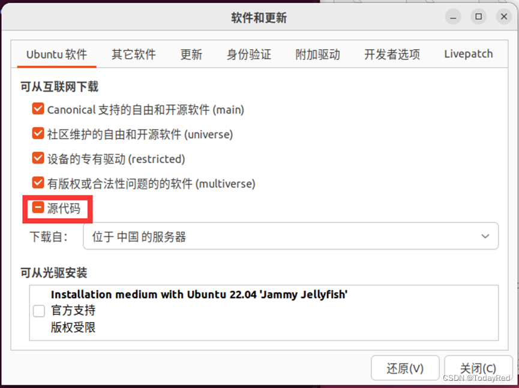
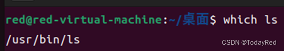
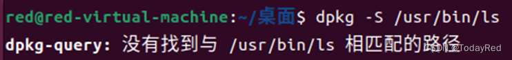
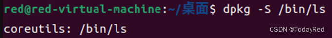
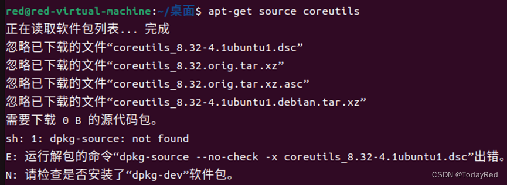
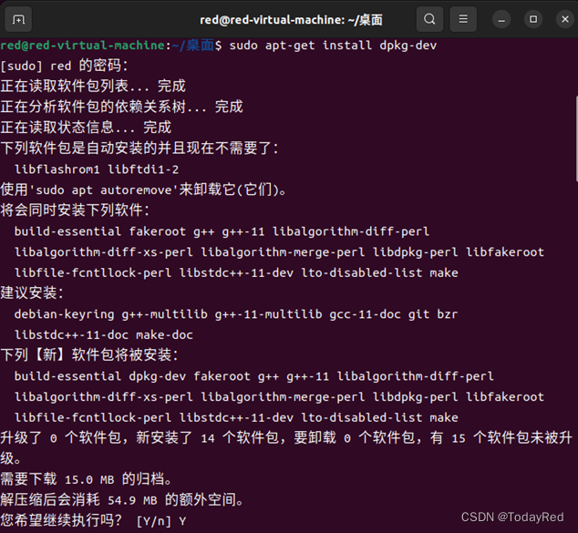
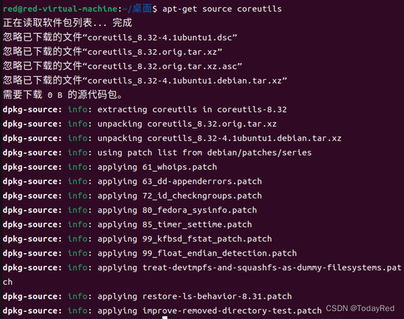
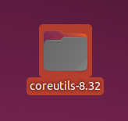
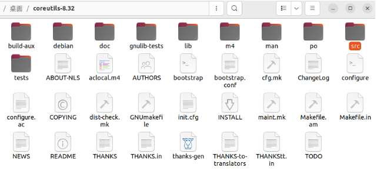
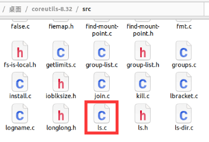

# 查找Linux命令源码(Ubuntu22.04)

做课设有阅读源码的需求，因此记录了以下查看源码的部分过程，也有参考网上部分教程。

运行以下命令，获取coreutils包的源代码

```bash
sudo apt-get source coreutils 
```

若出现以下报错

> Error：E: 您必须在 sources.list 中指定代码源(deb-src) URI

可运行以下命令更改设置

```bash
sudo software-properties-gtk
```

等待窗口弹出后选中源代码并关闭



以`ls`命令为例：

用`which`命令查找所在目录



> dpkg -s \<package\>用于查看软件包（已安装）的详细信息

运行以下命令

```bash
dpkg -S /usr/bin/ls
```

发现该路径下没有coreutils软件包的信息



尝试换为以下命令

```bash
dpkg -S /bin/ls
```

得到如下结果，说明系统已在`/bin/ls`位置下安装coreutils软件包



使用命令，下载源代码

```bash
apt-get source coreutils
```

出现报错



确保系统在连网情况下执行以下操作：

```bash
sudo apt-get install dpkg-dev
```



输入密码后等待系统反应，选择继续执行（Y）

等待安装完成后，再次尝试命令

```bash
apt-get source coreutils
```



成功下载，下载完成后桌面会出现下列文件夹：

Coreutils-8.32，数字与版本相关



打开文件夹，找到src文件夹并打开：



其中，`ls.h`和`ls.c`即为`ls`命令相关源代码。

