# CentOS 7.9安装合集

ssh远程登录服务器
```bash showLineNumbers
ssh username@ip
# username@ip's password:
# 密码登录：输入密码即可

# 密钥登录：回车即可
```

## MySQL

### 安装
:::danger

如果直接使用命令安装MySQL：`yum install mysql-community-server`
会踩坑：No package mysql-community-server available. Error: Nothing to do

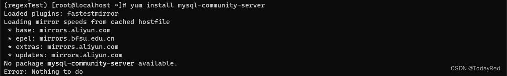
:::

用wget命令安装rpm包：（逐行执行下列命令）

```bash
wget https://repo.mysql.com//mysql80-community-release-el7-1.noarch.rpm
rpm -ivh mysql80-community-release-el7-1.noarch.rpm
```

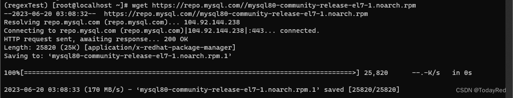


:::danger
如果直接使用`yum install mysql-community-server`命令，可能出现报错：

Failing package is: mysql-community-common-8.0.33-1.el7.x86_64
 GPG Keys are configured as: file:///etc/pki/rpm-gpg/RPM-GPG-KEY-mysql。
 
报错具体内容是说系统中的GPG Keys已经配置为使用文件`/etc/pki/rpm-gpg/RPM-GPG-KEY-mysql`进行MySQL软件包的数字签名验证。

:::

可以选择绕开数字签名验证安装MySQL：

```bash
yum -y install mysql mysql-server --nogpgcheck
```
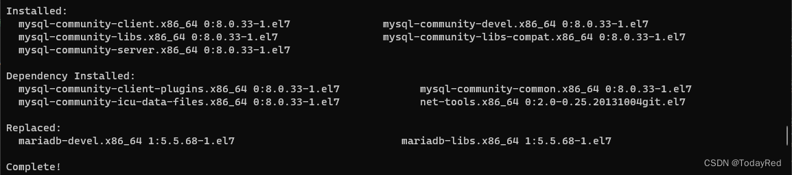

检验是否安装成功

```bash
rpm -qa | grep mysql
```

如果安装成功，会得到类似下图的输出:

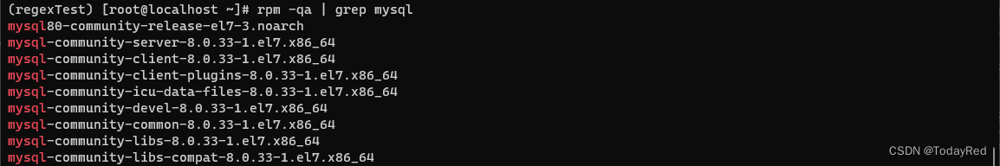

### 配置密码

启动MySQL

```bash
systemctl start mysqld
```

生成临时密码

```bash
grep 'temporary password' /var/log/mysqld.log
```

可以看到生成的临时密码：`root@localhost: <temp_pwd>`

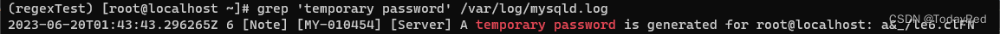

登录MySQL：注意-p与密码之间直接连接，不用空格。

```bash
mysql -uroot -p<pwd>
```

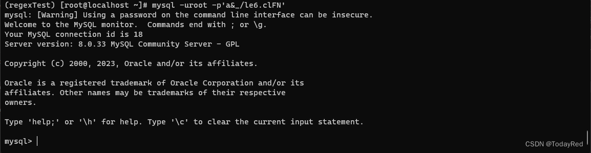


现在准备修改密码

查看MySQL的密码策略：

```sql
SHOW VARIABLES LIKE 'validate_password%';
```

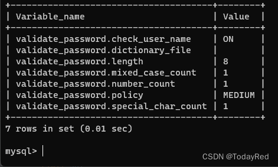

其中，validate_password.policy对应密码的强弱程度；validate_password.length对应密码长度。MySQL系统默认policy为1(MEDIUM，密码至少包含6个字符，并且必须包含一个数字和一个字母)，length默认为8。

MySQL设置密码复杂程度分**LOW/MEDIUM/STRONG**三种  
LOW ：密码至少包含4个字符。  
MEDIUM ：密码至少包含6个字符，并且必须包含一个数字和一个字母。  
STRONG ：密码至少包含8个字符，并且必须包含一个数字、一个小写字母、一个大写字母和一个特殊字符。  

参数说明详见官方文档：[MySQL :: MySQL 8.0 Reference Manual :: 6.4.3.2 Password Validation Options and Variables]

:::danger
ERROR 1819 (HY000): Your password does not satisfy the current policy requirements

初始情况下MySQL对密码有限定，如果设置的密码不符合mysql的要求则报错。
:::

:::danger
ERROR 1193 (HY000): Unknown system variable 'validate_password_policy'

需要注意的是MySQL 8.0版本下 **`validate_password.policy`** 对应旧版的`validate_password_policy`； **`validate_password.length`** 对应`validate_password_length`，如果在8.0中使用旧版的变量名称(`validate_password_policy`/`validate_password_length`)，则报错。

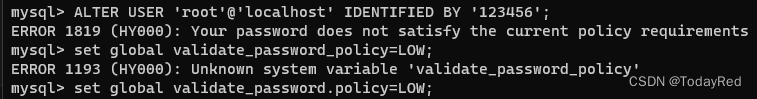
:::

如果想要修改策略，逐条执行如下命令

```sql
set global validate_password.policy=LOW;
set global validate_password.length=<length>;
```

修改好MySQL系统设置后，输入如下命令修改MySQL登录密码：
```sql
ALTER USER 'root'@'localhost' IDENTIFIED BY <pwd>;
```

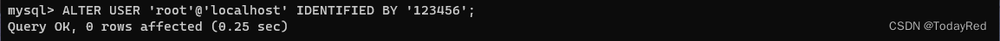

退出后重新登录，成功登录即完成配置

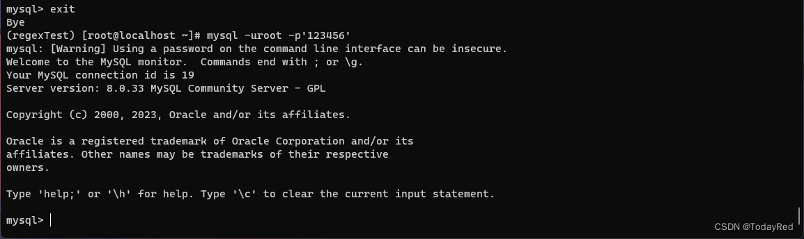

## Miniconda

[Miniconda官网]其实有给出快速安装的命令，逐条执行如下即可

```bash showLineNumbers
mkdir -p ~/miniconda3
wget https://repo.anaconda.com/miniconda/Miniconda3-latest-Linux-x86_64.sh -O ~/miniconda3/miniconda.sh
bash ~/miniconda3/miniconda.sh -b -u -p ~/miniconda3
rm -rf ~/miniconda3/miniconda.sh
 
~/miniconda3/bin/conda init bash
~/miniconda3/bin/conda init zsh
```

完成后执行 conda --version，能看到版本即为安装完成

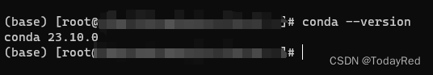

## Docker

### 卸载旧版本

```bash showLineNumbers
sudo yum remove docker \
                  docker-client \
                  docker-client-latest \
                  docker-common \
                  docker-latest \
                  docker-latest-logrotate \
                  docker-logrotate \
                  docker-engine
```
### 安装
[Docker官网]有给出多种安装方式。CentOS7系统中，默认安装rpm，因此选择rpm安装

```bash showLineNumbers
# 安装
# 逐条执行如下命令
sudo yum install -y yum-utils
sudo yum-config-manager --add-repo https://download.docker.com/linux/centos/docker-ce.repo
sudo yum install docker-ce docker-ce-cli containerd.io docker-buildx-plugin docker-compose-plugin
```

执行完成后，执行`docker -v`，能看到版本即为安装完成

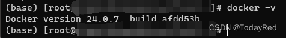

## Python

安装Miniconda的时候会安装Python，由于前面选择的latest，因此执行`python --version`，能看到安装了版本为3.11的Python。

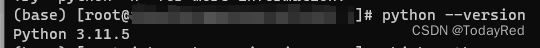

如果想要安装其他版本的Python，用Miniconda新建一个虚拟环境，指定Python环境即可。个人觉得比`yum install`再编译啥的简单方便得多。

```bash
conda create --name <env name> python=<version>
# eg: conda create --name test python=3.8
```

虚拟环境建好后用`conda activate <env name>`进入虚拟环境，执行`python --version`可以看到此时的python版本为3.8

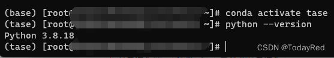


## Nginx

执行如下命令即可：

```bash
sudo yum install nginx
```

安装完成后用`nginx -version`可查看当前安装的nginx版本，默认版本为`nginx/1.20.1`。


## Go
### 安装
如果没有安装过go，执行如下命令即可：

```bash
sudo yum install go
```

安装完成后用`go version`可查看当前安装的go版本，默认版本为 go1.19.13 linux/amd64。

### 卸载旧版本
如果想要重装，首先需要卸载已有的Go：

```bash
yum remove go
```

再次运行`sudo yum install go`，可以正常进行安装操作。

## Node.js

之前一直想整个Docusaurus下来玩玩，而Docusaurus要求版本高于node v18。如果直接用`yum install`，安装的最高版本只到v16。

试过软链接，但不管用。软链接安装的node在使用`node -v`命令时系统会报错。跳转到`/usr/local/bin`，尝试删除node链接，系统提示该链接为dangling link。

再换个思路，直接下载tar.gz包自行编译安装。这个方式需要g++版本高于8.0，用`g++ --version`查看版本，发现只有4.8.5。升级gcc/g++版本不在此赘述，有篇优质好文提供了解决方案：[【Linux基础】CentOS 7环境下安装高版本GCC (gcc/g++ 9.3)]。这里把gcc/g++升级到了8.0。

在官网下载tar.gz包，这里下载的是v18.16.0，也可以替换成其他的版本。然后依次执行如下命令：

```bash showLineNumbers
tar -xf node-v18.16.0.tar.gz
cd node-v18.16.0
./configure
make
sudo make install
```

其中执行`make`命令的用时会比较长，大概两个小时左右。


[Miniconda官网]:https://docs.conda.io/projects/miniconda/en/latest/

[Docker官网]:https://docs.docker.com/engine/install/centos/#install-using-the-repository

[【Linux基础】CentOS 7环境下安装高版本GCC (gcc/g++ 9.3)]:https://blog.csdn.net/b_ingram/article/details/121569398

[MySQL :: MySQL 8.0 Reference Manual :: 6.4.3.2 Password Validation Options and Variables]:https://dev.mysql.com/doc/refman/8.0/en/validate-password-options-variables.html