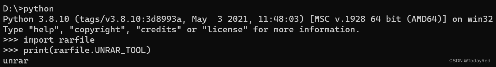
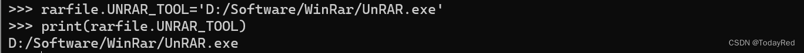
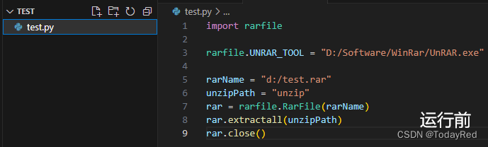
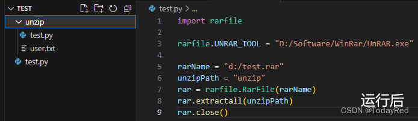
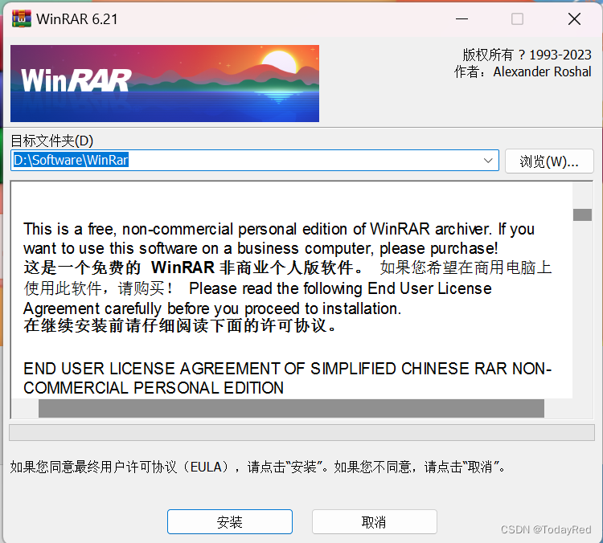
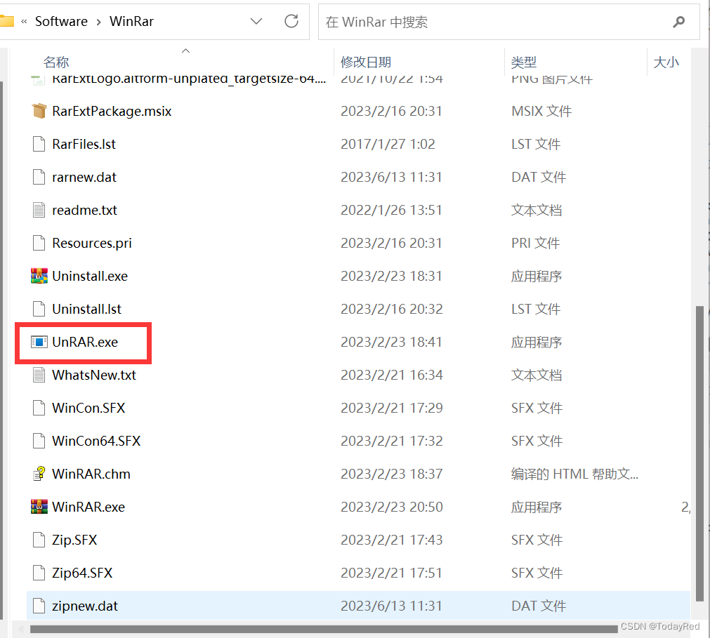
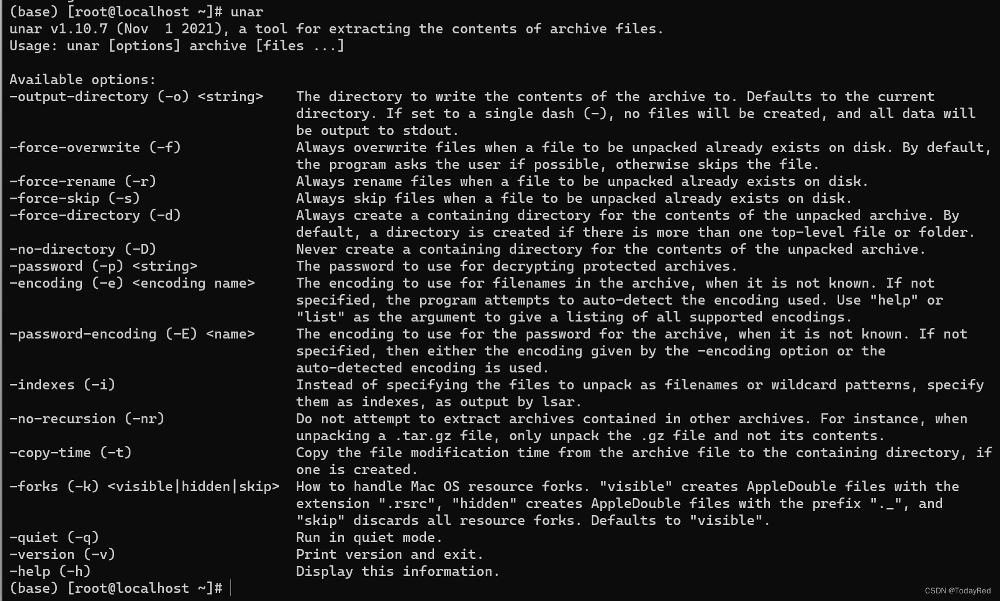
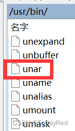

# rarfile报错：Cannot find working tool

之前在开发过程中使用rarfile库解压rar，但是运行时报上述错误，总结了一下一些可能的原因：

## 没有显式说明rarfile库的解压组件路径

在python中导入rarfile库，打印查看默认rarfile的解压组件路径



发现默认路径是unrar，大概率与安装的rar解压组件的路径不同。因此需要显式说明：



如果使用windows，找到解压组件所在路径，代码添加如下内容后，重新运行即可：

```python
import rarfile
rarfile.UNRAR_TOOL = "D:/Software/WinRar/UnRAR.exe"
```

如果使用linux（以CentOS为例），找到解压组件所在路径，代码添加如下内容后，重新运行即可：

```python
import rarfile
rarfile.UNRAR_TOOL="/usr/bin/unar"
```

测试一下




## 没有安装解压rar的相关组件

rarfile库安装之后，如果没有相关解压组件支撑则运行失败。换言之，这个库调用解压组件去辅助解压rar压缩包。如果没安装rar解压工具可以参考如下安装过程。

### Windows下安装RAR解压工具WinRAR
官方网址如下：

[WinRAR archiver, a powerful tool to process RAR and ZIP files (rarlab.com)]

如果这个网站打不开，可以试试下列网址：

[WinRAR - 压缩软件 老牌压缩软件知名产品 经典装机软件之一]

选择64位下载，等待下载完成。打开软件，按照指引选择好路径并安装。



安装完成后，打开刚才的路径`D:\Software\WinRar`，可以看到路径下有一个叫`UnRAR.exe`的程序。rarfile库调用这个程序完成解压操作。



### Linux环境（以CentOS为例）安装unar

安装unar（没错，不是unrar）步骤如下：

1. sudo yum更新，系统会提示xxx内容更新，是否确认安装，选择确认并等待更新完成。如果您认为这一步可能等待时间较长，也可以尝试直接从第2步开始。

```bash
sudo yum update
```

2. 安装epel-release，如果已有epel-release可跳过这一步

```bash
sudo yum install epel-release
```

> EPEL (Extra Packages for Enterprise Linux)是基于Fedora的一个项目，为“红帽系”的操作系统提供额外的软件包，适用于RHEL、CentOS和Scientific Linux.

3. 安装unar，选择默认安装即可

```bash
sudo yum install unar
```

安装完成后，如果键入`unar`并回车，出现如下图内容，那么恭喜安装成功。



现在打开路径（默认安装到`/usr/bin/`路径下），可以看到路径下有一个名叫unar的文件。rarfile库调用这个文件完成解压操作。



[WinRAR - 压缩软件 老牌压缩软件知名产品 经典装机软件之一]:https://www.winrar.com.cn/

[WinRAR archiver, a powerful tool to process RAR and ZIP files (rarlab.com)]:https://www.rarlab.com/download.htm
