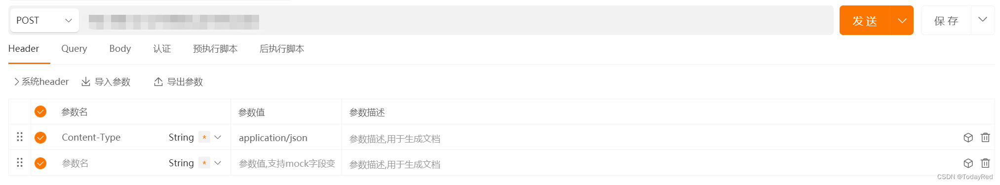
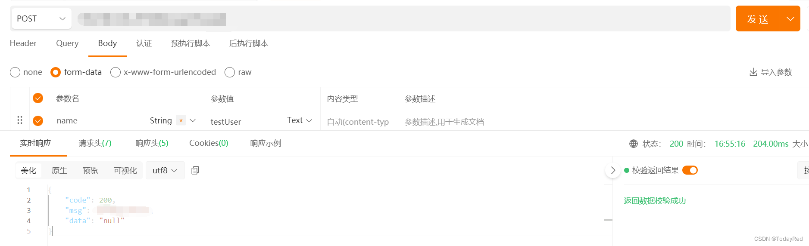

# Did not attempt to load JSON data because the request Content-Type was not ‘application/json‘

用python flask做coding过程中，拿Apipost测试接口时遇到的问题，解决方案如下：

## 在请求头手动添加属性



重新发送请求。如果成功，那么恭喜。如果还是报同样的错误，继续往下看。

## 检查代码

coding时用了flask_restful和Blueprint。在接收前端发送的数据时，flask_restful下的`reqparse.RequestParser()`验证数据是否符合指定类型。**But！这里有个坑！flask2.0版本以前的reqparse 模块的默认行为是尝试从请求中的多个位置（args/form/json等）提取参数**。因此可以直接用如下代码做验证：

```python
class DoSomething(Resource):
    def __init__(self):
        self.parser = reqparse.RequestParser()
        self.parser.add_argument("name",type=str,required=True)
    def post(self):
        args = self.parser.parse_args()
```

但是这种默认行为会带来不确定性。当参数同时出现在form和args中，此时无法确定参数来源。

:::important
在flask版本2.0之后，为了避免不确定性，引入了**location参数**。
:::

上述代码修改如下：
```python
class DoSomething(Resource):
    def __init__(self):
        self.parser = reqparse.RequestParser()
        self.parser.add_argument("name",type=str,required=True, location="form")
    
    def post(self):
        args = self.parser.parse_args()
```

再次发送请求，返回200。

