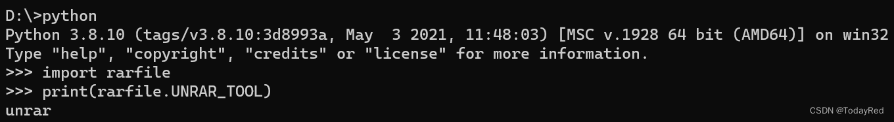
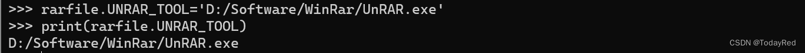
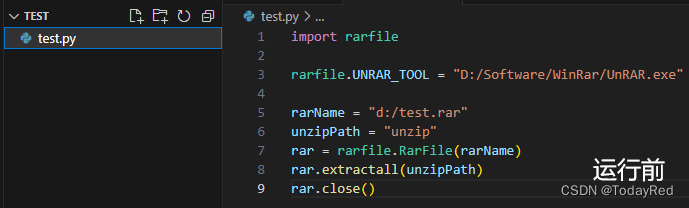
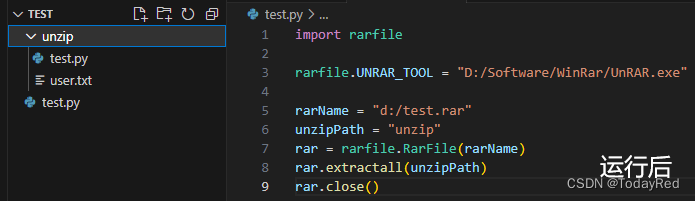
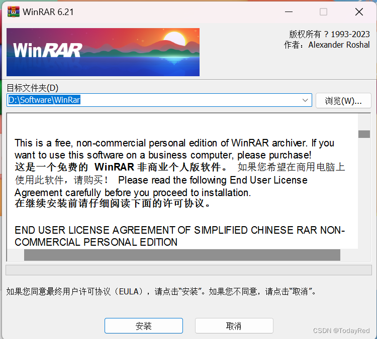
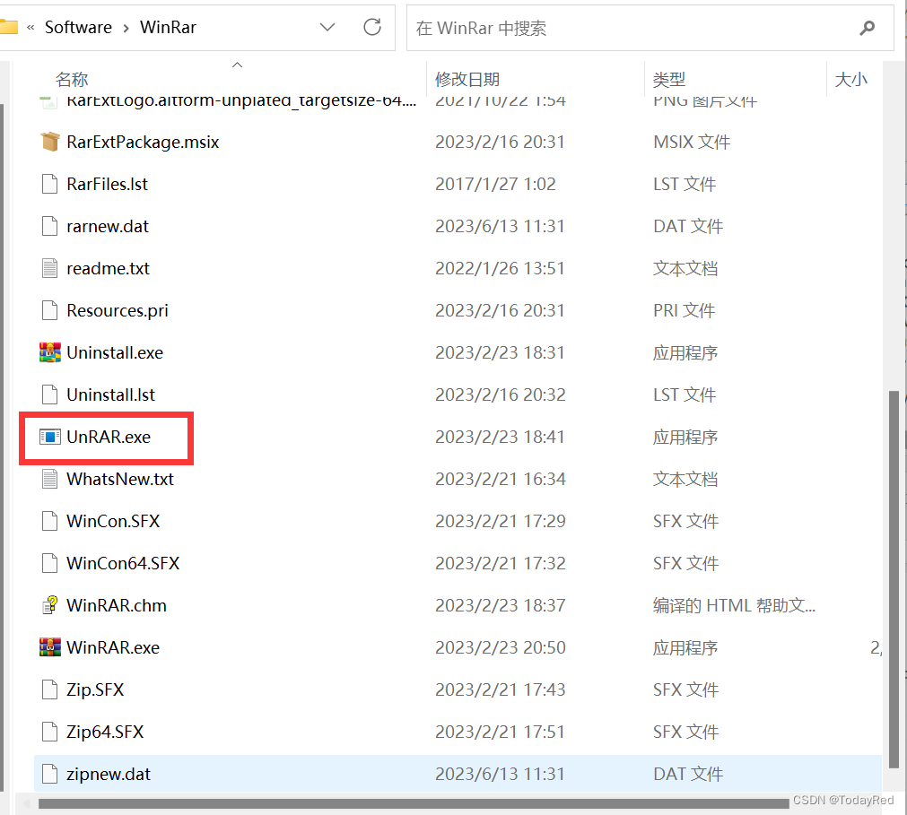
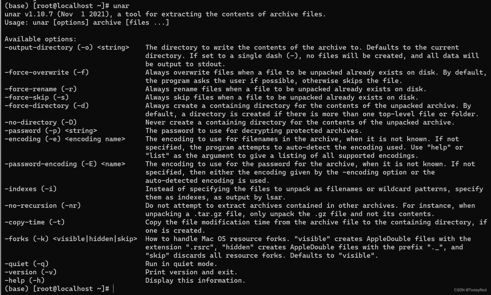
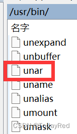
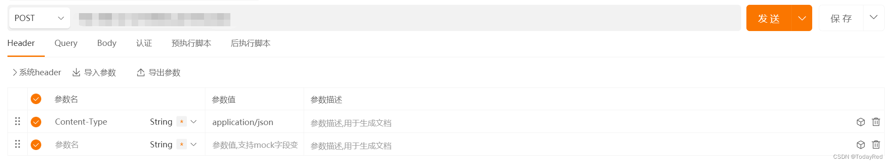
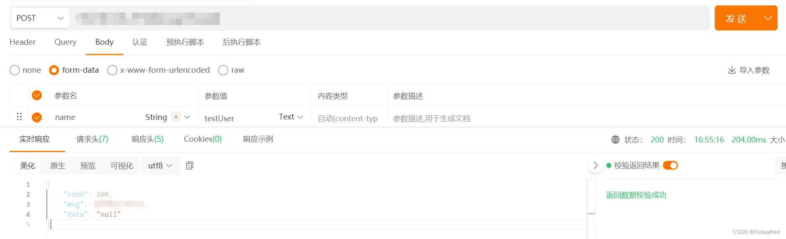

# 报错记录

## rarfile报错：Cannot find working tool

之前在开发过程中使用rarfile库解压rar，但是运行时报上述错误，总结了一下一些可能的原因：

### 未显式说明rarfile库解压组件路径

在python中导入rarfile库，打印查看默认rarfile的解压组件路径



发现默认路径是unrar，大概率与安装的rar解压组件的路径不同。因此需要显式说明：



如果使用windows，找到解压组件所在路径，代码添加如下内容后，重新运行即可：

```python
import rarfile
rarfile.UNRAR_TOOL = "D:/Software/WinRar/UnRAR.exe"
```

如果使用linux（以CentOS为例），找到解压组件所在路径，代码添加如下内容后，重新运行即可：

```python
import rarfile
rarfile.UNRAR_TOOL="/usr/bin/unar"
```

测试一下




### 没有安装解压rar的相关组件

rarfile库安装之后，如果没有相关解压组件支撑则运行失败。换言之，这个库调用解压组件去辅助解压rar压缩包。如果没安装rar解压工具可以参考如下安装过程。

#### Windows下安装RAR解压工具WinRAR
官方网址如下：

[WinRAR archiver, a powerful tool to process RAR and ZIP files (rarlab.com)]

如果这个网站打不开，可以试试下列网址：

[WinRAR - 压缩软件 老牌压缩软件知名产品 经典装机软件之一]

选择64位下载，等待下载完成。打开软件，按照指引选择好路径并安装。



安装完成后，打开刚才的路径`D:\Software\WinRar`，可以看到路径下有一个叫`UnRAR.exe`的程序。rarfile库调用这个程序完成解压操作。



#### Linux环境（以CentOS为例）安装unar

安装unar（没错，不是unrar）步骤如下：

1. sudo yum更新，系统会提示xxx内容更新，是否确认安装，选择确认并等待更新完成。如果您认为这一步可能等待时间较长，也可以尝试直接从第2步开始。

```bash
sudo yum update
```

2. 安装epel-release，如果已有epel-release可跳过这一步

```bash
sudo yum install epel-release
```

> EPEL (Extra Packages for Enterprise Linux)是基于Fedora的一个项目，为“红帽系”的操作系统提供额外的软件包，适用于RHEL、CentOS和Scientific Linux.

3. 安装unar，选择默认安装即可

```bash
sudo yum install unar
```

安装完成后，如果键入`unar`并回车，出现如下图内容，那么恭喜安装成功。



现在打开路径（默认安装到`/usr/bin/`路径下），可以看到路径下有一个名叫unar的文件。rarfile库调用这个文件完成解压操作。



## Did not attempt to load JSON data because the request Content-Type was not ‘application/json‘

用python flask做coding过程中，拿Apipost测试接口时遇到的问题，解决方案如下：

### 在请求头手动添加属性



重新发送请求。如果成功，那么恭喜。如果还是报同样的错误，继续往下看。

### 检查代码

coding时用了flask_restful和Blueprint。在接收前端发送的数据时，flask_restful下的`reqparse.RequestParser()`验证数据是否符合指定类型。**But！这里有个坑！flask2.0版本以前的reqparse 模块的默认行为是尝试从请求中的多个位置（args/form/json等）提取参数**。因此可以直接用如下代码做验证：

```python
class DoSomething(Resource):
    def __init__(self):
        self.parser = reqparse.RequestParser()
        self.parser.add_argument("name",type=str,required=True)
    def post(self):
        args = self.parser.parse_args()
```

但是这种默认行为会带来不确定性。当参数同时出现在form和args中，此时无法确定参数来源。

:::important
在flask版本2.0之后，为了避免不确定性，引入了**location参数**。
:::

上述代码修改如下：
```python
class DoSomething(Resource):
    def __init__(self):
        self.parser = reqparse.RequestParser()
        self.parser.add_argument("name",type=str,required=True, location="form")
    
    def post(self):
        args = self.parser.parse_args()
```

再次发送请求，返回200。




[WinRAR - 压缩软件 老牌压缩软件知名产品 经典装机软件之一]:https://www.winrar.com.cn/

[WinRAR archiver, a powerful tool to process RAR and ZIP files (rarlab.com)]:https://www.rarlab.com/download.htm
