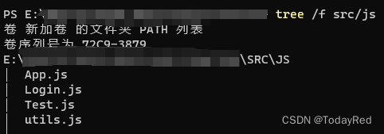

# 回退至上一页并刷新数据

## 起因+思考过程
想着做一个能从页面A跳转到登录页面，登录成功再跳转回页面A的功能。因此个人思路是登录后回到上一个页面并刷新数据。网上有搜索出来大部分都是用`useHistory`，而useHistory在版本v6之后已不再使用。由于个人不太想回退`react-router-dom(6.16.0)`的版本。因此尝试除了useHistory之外的一些方法。

### 回退+刷新 放同一箭头函数中

箭头函数eg: `const xxx = () => {...}`

这个能够回退到上一个界面，但是没有刷新内容，因此被弃掉。而且类似这样的代码：

```jsx
function Login(){
    const checkThenBackRefresh = () =>{
        //...登录处理代码
        window.history.back();
        //...刷新代码
    }
    //...仅显示调用代码
    return(
        <div>
            <button htmlType="submit" onClick={checkThenBackRefresh}>
                SEND
            </button>
        </div>
    )
}
```

实际上在执行完`window.history.back`后，此时已经跳转到其他URL了，并不会执行后续刷新部分的代码。此时的刷新代码等效于在一个函数return后的代码。

### 登录仅放回退功能，刷新放在URL对应代码

直接把回退+刷新放在一个箭头函数中并不可取，因此考虑分开放。

```jsx
function Login(){
    const checkThenBack = () =>{
        //...登录处理代码
        window.history.back();
    }
    //...仅显示调用代码
    return(
        <div>
            <button htmlType="submit" onClick={checkThenBack}>
                SEND
            </button>
        </div>
    )
}
```

```jsx
// 页面A放刷新代码
function Test(){
    useEffect(() => {
        window.location.reload();
    }, [location.pathname]);
 
    return(
        //...详细代码省略
    )
}
```

如果直接用`window.location.reload`，会**刷新整个页面并重新加载所有的JavaScript和CSS文件**，尽管输出的pathname相同，网页还是会一直在刷新，因此该方法也不可行。

### 跳转前处理，为回退做准备

有搜到过`history.push('/path');`和`history.goBack();`，因此在想是否也能做类似处理。此种方案下可能不需要额外刷新内容，在回退到指定路径下，组件重新渲染，`useEffect`重新获取数据。

## 解决方案

有了回退准备的前提下，编写代码并测试无误后，得到如下内容：

```jsx
//utils.js
export function toLogin(navigate) {
    navigate('/login')
}
```

```jsx
// 页面A
import { useNavigate } from "react-router-dom";
import { toLogin } from './utils.js';
 
function Test(){
    const navigate = useNavigate()
 
    return(
        <div>
            <h4>
                请先<a onClick={() => toLogin(navigate)}>登录</a>
            </h4>
        </div>
    )
}
```

```jsx
// 登录页面
import { useNavigate } from "react-router-dom";
 
function Login(){
    const navigate = useNavigate();
    const checkThenBack = () =>{
        //...登录处理代码
        navigate(-1);
    }
 
    //...仅显示调用代码
    return(
        <div>
            <button htmlType="submit" onClick={checkThenBack}>
                SEND
            </button>
        </div>
    )
}
```

```jsx
// App.js
import { BrowserRouter, Routes, Route } from 'react-router-dom';
import React, { Component } from 'react';
import Test from './Test.js';
import Login from './Login.js';
 
function App() {
  return (
    <BrowserRouter>
      <div className="App">
        <Routes>
          <Route path='/' element={<Test/>} />
          <Route path='/login' element={<Login />} />
        </Routes>
      </div>
    </BrowserRouter>
  );
}
 
export default App;
```

代码的层级结构如下：

