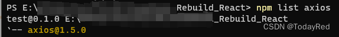

# 使用axios库完成前后端通信

## 相关介绍

axios介绍摘自官方文档：

> Axios 是一个基于`promise`网络请求库，作用于`node.js`和浏览器中。 它是 isomorphic 的(即同一套代码可以运行在浏览器和node.js中)。在服务端它使用原生 node.js http 模块, 而在客户端 (浏览端) 则使用 XMLHttpRequests。

注：axios依赖原生的ES6 Promise实现。

想要完成前后端通信，在借助axios库的同时还需要遵守同源策略。**同源策略**是指出于安全考虑，只允许同源下的接口交互，能帮助阻隔恶意文档，减少可能被攻击的媒介。**同协议、同IP、同端口视为同源**。如果没有遵守同源策略，会产生跨域问题。

|           URL1            |           URL2            | 是否同源 |         说明         |
| :-----------------------: | :-----------------------: | :------: | :------------------: |
|   `http://www.xxx.com`    |   `https://www.xxx.com`   |    x     |    使用的协议不同    |
|   `http://www.xxx.com`    |   `http://www.yyy.com`    |    x     |     使用的IP不同     |
| `http://www.xxx.com:8000` | `http://www.xxx.com:8080` |    x     |    使用的端口不同    |
| `http://www.xxx.com/test` | `http://www.xxx.com/dev`  |    √     | 同协议、同IP、同端口 |

对于前后端分离的应用，前后端分别在不同的端口运行（如前端运行在端口3000，后端运行在端口5000），必然出现跨域问题。这里选择使用代理，将指定URL请求代理到目标位置下进行处理，从而解决跨域问题。

## 步骤

### 配置代理

要完成前后端通信，需要**解决跨域问题**。因此需要**配置代理**。在正式部署前我们可以做简单配置。

下载http-proxy-middleware库

```bash
npm install --save-dev http-proxy-middleware
```

在index.js同层级下新建一个文件：setupProxy.js，具体代码如下：

```jsx
const { createProxyMiddleware } = require('http-proxy-middleware')
 
module.exports = function (app) {
    app.use(
        createProxyMiddleware('/api', {
            target: 'http://127.0.0.1:5000',
            changeOrigin: true,
            pathRewrite: {
                '/oldPath': '/newPath',
            },
        }))
}
```

`createProxyMiddleware`部分参数含义如下表：详细内容可查看[官方文档]

<table>
    <tr>
        <td>参数名称</td> 
        <td>含义</td> 
        <td>示例</td> 
   </tr>
    <tr>
        <td>上下文context</td> 
        <td>指定代理哪些内容：以指定开头的请求进行代理。 </td> 
        <td>single：'/api' <br/> multiple：['/api', '/test', ...]</td> 
   </tr>
   <tr>
        <td>可选项options </td>
        <td>转发的具体配置，也即怎么转发</td>
        <td>\{xxx:xxx\}</td>
   </tr>
    <tr>
        <td colspan="3">第二个参数 内部参数含义</td>    
    </tr>
   <tr>
        <td>target</td>
        <td>代理的目标主机，如果是本地建议使用127.0.0.1，localhost会因为xxx失败</td>
        <td>`http://127.0.0.1:5000`</td>
   </tr>
   <tr>
        <td>changeOrigin</td>
        <td>将主机头的来源更改为目标 URL，默认是false</td>
        <td>true/false</td>
   </tr>
   <tr>
        <td>pathRewrite</td>
        <td>重写目标的url路径。如果不需要重写则可以省略。</td>
        <td>'/oldPath': '/newPath'</td>
   </tr>
</table>

正式部署时，如果用的是`npm run build`打包并做静态部署，那么**setupProxy会失效**，此时需要用nginx部署前端并配置代理。

### 安装并导入axios库

使用npm命令下载axios库

```bash
npm install axios
```

可用npm list axios命令查看axios版本，这里用的是1.5.0



然后在js文件中导入

```bash
import axios from 'axios'
```

### 调用接口并处理返回数据

在完成代理配置后，我们就可以调用axios以完成前后端通信。

假设现在要发送一个post请求，传参使用**form-data**，并存储响应数据：

```jsx
import axios from 'axios';
function Test(){
    // 用于存储接口响应
    const [data, setData] = useState({});
 
    useEffect(()=>{
        // 创建form-data
        const formData = new FormData();
        formData.append('start', 1);
        formData.append('end', 400);
 
        // 发送一个post请求
        axios.post('/path', formData)
        .then(response => {
            // 将返回的数据存入到data中
            setData(response.data);
 
            // 在控制台可以看到输出的data
            console.log(data);
        })
        .catch(error => {
            console.log(error);
        });
    }, []);
 
    return(
        // 自定义展示data
    )
}
 
export default Test;
```

GET请求同理：

```jsx
import axios from 'axios';
function Test(){
    // 用于存储接口响应
    const [data, setData] = useState({});
 
    useEffect(()=>{
 
        // 发送一个get请求
        axios.get('/path')
        .then(response => {
            // 将返回的数据存入到data中
            setData(response.data);
 
            // 在控制台可以看到输出的data
            console.log(data);
        })
        .catch(error => {
            console.log(error);
        });
    }, []);
 
    return(
        // 自定义展示data
    )
}
 
export default Test;
```

[官方文档]:http://www.npmdoc.org/http-proxy-middlewarezhongwenwendanghttp-proxy-middleware-jszhongwenjiaochengjiexi.html#http-proxy-middleware-options