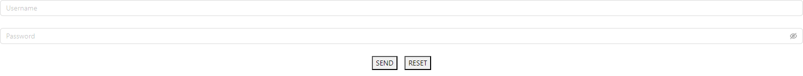
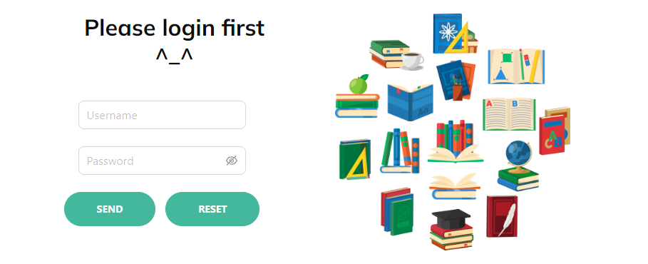
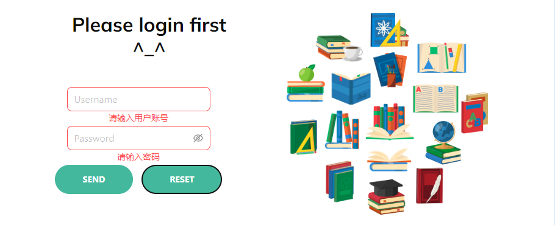

# 表单验证

表单验证能够有效减少用户输错信息或者输入恶意信息的行为，更好保证了用户数据的安全性。而 antd 作为基于 React 开源组件库，提供了包含表单在内的多种 UI 组件库。该表单提供了表单验证选项，下面将展开介绍。

## 安装antd

使用 antd 组件库需要先安装：

```bash
npm install antd --save
```

在最新版本的 npm（5.0.0及以上）中，`--save` 是默认行为，当执行 `npm install antd` 时，会自动将依赖项保存到 package.json 文件中的 dependencies 字段中。

## 构建表单
编写如下代码即可得到一个表单：

```jsx
import { Form } from 'antd'

function Test(){
    return(
        <Form>
            <Form.Item>
                <Input placeholder='Username' />
            </Form.Item>

            <Form.Item>
                <Input.Password placeholder='Password' />
            </Form.Item>

            <div className="btn-box">
                <button>
                    SEND
                </button>
                &emsp;
                <button>
                    RESET
                </button>
            </div>
        </Form >
    )
}
```

效果如图：



## 美化表单

很明显这样的表单过于简陋，此时添加参数进行美化。参数解释如下：

<table>
    <thead>
        <tr>
            <th style={{width: '20%'}}>标签</th>
            <th style={{width: '10%'}}>属性</th>
            <th style={{width: '40%'}}>说明</th>
            <th style={{width: '30%'}}>举例</th>
        </tr>
    </thead>
    <tbody >
        <tr >
            <td rowSpan='7'>Form</td>
            <td>labelCol</td>
            <td>label 标签布局，设置 `span` `offset` 值</td>
            <td>`labelCol={{ span: 6 }}`</td>
        </tr>
        <tr >
            <td>wrapperCol</td>
            <td>需要为输入控件设置布局样式时，使用该属性，用法同 `labelCol`</td>
            <td>`wrapperCol={{ span: 24 }}`</td>
        </tr>
        <tr >
            <td>layout</td>
            <td>排布方式，垂直/横向</td>
            <td>`layout="horizontal"`</td>
        </tr>
        <tr >
            <td>size</td>
            <td>表单大小，可设定的值为 small / default / large</td>
            <td>`size='large'`</td>
        </tr>
        <tr >
            <td>style</td>
            <td>其他自定义样式</td>
            <td>`style={{ maxWidth: 600 }}`</td>
        </tr>
        <tr >
            <td>ref</td>
            <td>引用，可以预先创建一个ref引用对象，然后传递给Form组件的ref属性，以便操作Form实例，如手动触发表单校验或者重置表单等</td>
            <td>`ref={xxx}`</td>
        </tr>
        <tr >
            <td>form</td>
            <td>经 `Form.useForm()` 创建的 form 控制实例，不提供时会自动创建</td>
            <td>/</td>
        </tr>
        <tr >
            <td rowSpan='2'>Form.Item</td>
            <td>name</td>
            <td>表单项的名称</td>
            <td>`name='logId'`</td>
        </tr>
        <tr >
            <td>rules</td>
            <td>校验规则，设置字段的校验逻辑，可以写入多条规则</td>
            <td>/</td>
        </tr>
        <tr>
            <td rowSpan='5'>Input<br/>输入框</td>
            <td>allowClear</td>
            <td>一键清空键</td>
            <td>/</td>
        </tr>
        <tr>
            <td>maxLength</td>
            <td>最大字数</td>
            <td>`maxLength={10}`</td>
        </tr>
        <tr>
            <td>onChange</td>
            <td>当输入框内容改变时的行为</td>
            <td>`onChange={xxx}`</td>
        </tr>
        <tr>
            <td>id</td>
            <td>设定ID</td>
            <td>`id="logId"`</td>
        </tr>
        <tr>
            <td>placeholder</td>
            <td>占位符</td>
            <td>`placeholder='Username'`</td>
        </tr>
    </tbody>
</table>

完整介绍见 [Form 表单]

## 表单校验规则书写

表单校验规则书写如下：

```jsx
rule={[
    {
        xxx: xxxxx,
        message: 'xxx'
    }
]}
```

多个校验规则可以写在同一个 `{}` 内，如设定表单内的一个输入框，必须输入一个上限为10个字符的内容：

```jsx
rule={[
    {
        required: true,
        type: number
        max:10,
        message: '请输入内容，至多10个字'
    }
]}
```

对于该输入框，存在多个校验。如果希望根据不同的输入错误给出对应的提示，可以把校验规则拆分到多个 `{}` 内：

```jsx
rule={[
    {
        required: true,
        message: '请输入内容'
    },
    {
        type: number,
        message: '输入类型错误'
    },
    {
        max: 10,
        message: '输入内容超出上限'
    }
]}
```
校验规则大致可以分为是否必填、填入内容的类型、填入内容的最小/最大值、填入内容是否符合规则等等。

### 是否必填

```jsx
rule={[
    {
        required: true,
        message: '请输入xxx'
    }
]}
```

### 内容类型

```jsx
rule={[
    {
        type: 'string' / 'number' / 'boolean' / 'url' / 'email',
        message: '请输入xxx类型的xxxx'
    }
]}
```

### 最小/最大值

```jsx
rule={[
    {
        max/min: number,
        message: '请填入至少/至多(数量)的xxx'
    }
]}
```

### 内容规则

```jsx
rule={[
    {
        pattern: r'...',
        message: '请输入（符合xxx规则）的内容'
    }
]}
```

除了上述提到的校验内容外，更多的校验内容见 [Ant Design Rule]

## 最终代码和效果

添加属性并再次美化后，得到如下代码：
```jsx
import React, { useEffect, useState, useReducer, useRef } from 'react'
import axios from 'axios';
import { LeftTextStyle, saveUser, ERROR, goBack, ItemCenter } from './utils.js';
import { Form, Image, Input } from 'antd';

function Test() {
    
    // 存储登录信息
    const [loginRes, setLoginRes] = useState();

    //与后端通信，判断密码是否与账户匹配
    const checkLoginInfo = (values) => {
        ... // 省略
    }

    //如果成功获取到了数据，存储并跳转回上一个页面
    //loginRes改变了意味着获取到了数据，因此可以跳转
    useEffect(() => {
        if (loginRes) {
            saveUser(loginRes.data);
            goBack();
        }
    }, [loginRes])
    
    const [form] = Form.useForm();
    const handleInputReset = () => {
        form.resetFields();
    }

    //登录验证
    const formRefLog = useRef(null);
    const isFirstSubmitLog = useRef(true);
    const submitFormLog = () => {
        formRefLog.current.validateFields().then(values => {
            if (isFirstSubmitLog.current) {
                checkLoginInfo(values);
                isFirstSubmitLog.current = false;
            }
        });
    }

    return (
        <div>
            <section className="contact_section layout_padding">
                <div className="container">
                    <div className="row">
                        <div className="col-md-5 ">
                            <div className="heading_container ">
                                <h2 className="">
                                    Please login first ^_^
                                </h2>
                            </div>
                            <Form
                                ref={formRefLog}
                                form={form}
                                labelCol={{ span: 6 }}
                                wrapperCol={{ span: 24 }}
                                layout="horizontal"
                                size='large'
                                style={{ maxWidth: 600 }}
                            >
                                <Form.Item
                                    name='logId'
                                    rules={[
                                        {
                                            required: true,
                                            message: '请输入用户账号',
                                        }
                                    ]}>
                                    <Input
                                        allowClear
                                        maxLength={10}
                                        id="logId"
                                        placeholder='Username' />
                                </Form.Item>

                                <Form.Item
                                    name='logPwd'
                                    rules={[
                                        {
                                            required: true,
                                            message: '请输入密码',
                                        }, {
                                            pattern: /^(?=.*[a-zA-Z])(?=.*[0-9])[A-Za-z0-9]{6,18}$/,
                                            message: '密码长度为6-18位，必须由字母、数字组成',
                                        }
                                    ]}>
                                    <Input.Password
                                        maxLength={18}
                                        allowClear
                                        placeholder='Password' />
                                </Form.Item>
                                <div className="btn-box" style={ItemCenter}>
                                    <a>
                                        <button style={{ fontWeight: 'bold' }} htmlType="submit" onClick={() => submitFormLog()}>
                                            SEND
                                        </button>
                                    </a>
                                    &emsp;
                                    <a>
                                        <button style={{ fontWeight: 'bold' }} onClick={() => handleInputReset()}>
                                            RESET
                                        </button>
                                    </a>
                                </div>
                            </Form >
                        </div>
                        <div className="col-md-6 offset-md-1">
                            <Image src={require(`../figures/contact-img.png`)} preview={false} alt="" />
                        </div>
                    </div>
                </div>
            </section>
        </div>
    )
}

export default Test;
```

美化后的页面如下：



如果直接提交或者点击重置键，此时页面显示如下：



[Form 表单]: https://012x.ant.design/components/form/#demo-inline-form
[Ant Design Rule]: https://ant.design/components/form-cn#rule